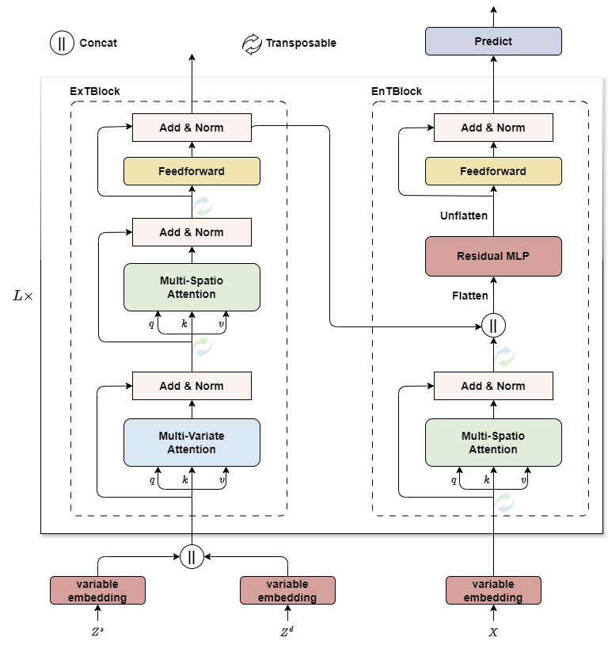

# 2DXformer: Dual Transformers for Wind Power Forecasting with Dual Exogenous Variables



​	this is the official pytorch implementation for the paper: 2DXformer: Dual Transformers for Wind Power Forecasting with Dual Exogenous Variables.

## Requirements

- pytorch >= 2.1.0
- pandas >= 0.19.2

## Data Preparation

​	The dataset SDWPF can be downloaded from [here](https://aistudio.baidu.com/competition/detail/152/0/introduction), and should be put into the `./data/SDWPF` folder. For more information about the SDWPF dataset, please refer to this [link](https://www.paddlepaddle.org.cn/support/news?action=detail&id=2950) or this [paper](https://arxiv.org/abs/2208.04360). If you want to use your own dataset, please refer to `./lib/load_dataset.py` to load it.

## Usage

​	You can simply run the code with the following command: 

```
python run_model.py
```